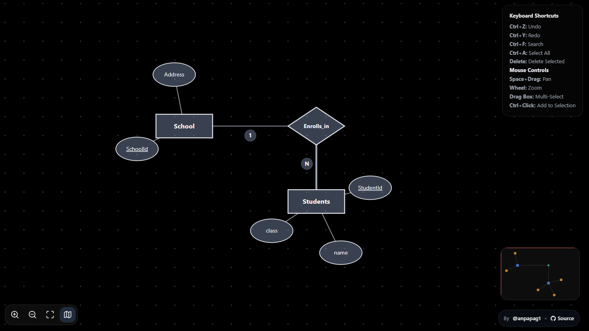
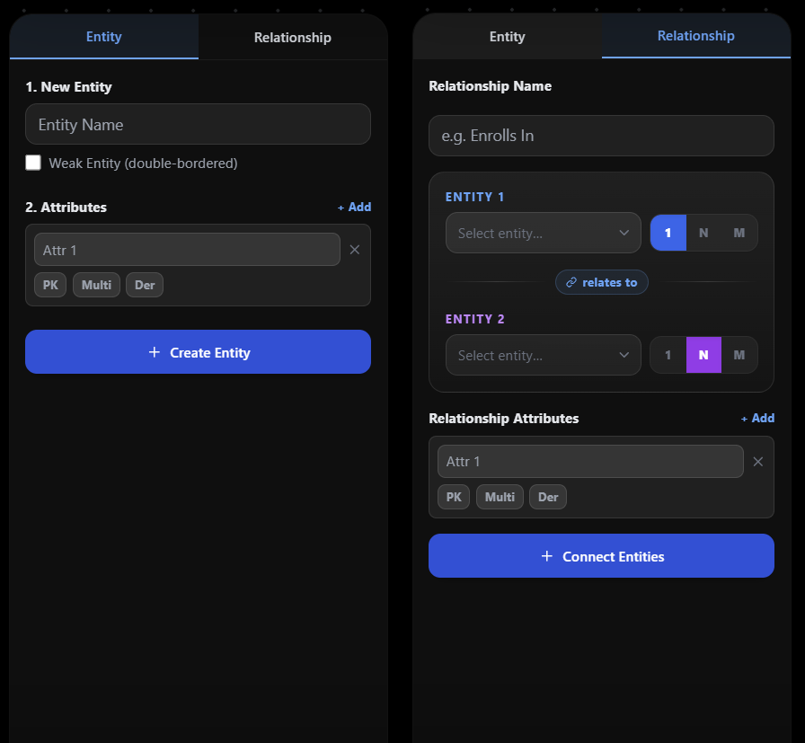
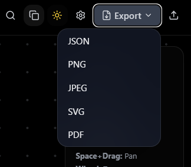
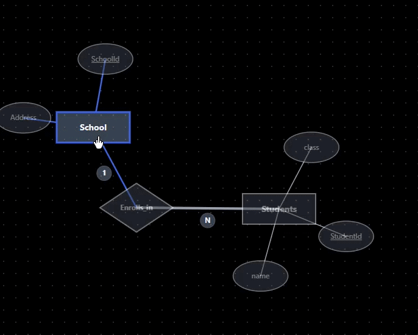

# ER-Tool
**A browser-based [ER diagram editor](https://anpapag1.github.io/er-tool) built out of pure procrastination.** 

 

Last semester I was taking Advanced Database Systems. The assignment was straightforward: design a database schema, wire it to a web app, produce an ER diagram. The professor pointed everyone to draw.io. Two hours, tops.

If you've ever tried to design a proper ER diagram in draw.io, you know exactly where this is going.

One week later, the assignment was submitted. The ER diagram was done. So was a fully custom, physics-simulated, SVG-rendered, shareable-via-URL ER diagram editor. Worth it? Yes. Unambiguously, yes.

---

## What It Is

ER Tool is a purpose-built ER diagram editor that runs entirely in the browser — no backend, no account, no friction. You open the page, type an entity name, and start building. Everything renders as pure SVG, so there's no pixelation, no canvas quirks, and export at any resolution works exactly as you'd expect.

The editor understands ER diagram semantics. It knows the difference between a regular entity and a weak one, between a plain attribute and a multivalued derived one, between a simple relationship and a one-to-many with cardinality labels. These aren't cosmetic — they render correctly per ER notation, with the shapes and line styles that actually mean something.

Diagrams live in the URL. Every entity, every connection, every layout position is compressed and encoded directly into a shareable link using lz-string. No server, no database, no saved state. If you can paste the link, the recipient gets the full diagram.

---

## Quick Start

1. **Create an entity** — type a name in the sidebar and click *Create Entity*. Add attributes and mark the primary key.
2. **Add a relationship** — switch to the Relationships tab, pick two entities, set the cardinality, and click *Add Relationship*.
3. **Auto-layout** — hit the layout button to let the physics engine arrange everything. Drag nodes to adjust manually.
4. **Share or export** — copy the URL to share the live diagram, or export to PNG, SVG, PDF, or JSON.

---

## Features

**Physics Auto-Layout** — Entities repel each other and relationships act as springs, so the diagram naturally untangles itself. Hit the auto-layout button and watch the chaos resolve.

**Weak Entities & Identifying Relationships** — Toggle an entity as weak and the editor renders the double-border notation and double-diamond relationship shape automatically.

**Multivalued & Derived Attributes** — Attributes support all four ER variants: simple, primary key (underlined), multivalued (double ellipse), and derived (dashed ellipse).

**Cardinality Labels** — Relationships carry source and target cardinality labels (1, N, M, etc.) positioned along the connecting lines.

**Shareable URL** — The entire diagram state is lz-string compressed and embedded in the URL hash. Copy the address bar, share it, and it opens exactly as you left it.

**Export Anywhere** — Download diagrams as PNG, JPEG, SVG, PDF, or JSON. The SVG export is clean and vector-perfect; the JSON export is re-importable.

**Undo / Redo** — Full 50-step history. Ctrl+Z / Ctrl+Y work as expected across all edit operations.

**Minimap** — A live thumbnail of the full canvas in the corner, useful when diagrams grow large.

**Dark Mode** — System preference is detected on load and can be toggled manually.

**Multi-Select** — Hold Shift or drag a selection box to select multiple nodes and move them together.

**Grid Snapping** — Optional snap-to-grid for obsessively aligned diagrams.

**Search** — Filter visible nodes by label when the diagram gets unwieldy.

> The editor follows Chen notation conventions as closely as practical in a browser context. A small number of rendering shortcuts were taken in the name of legibility at interactive zoom levels.

---

## Screenshots

### Canvas

### Sidebar

### Export

---

## Demo

> **[→ Open a ready-made example diagram](https://anpapag1.github.io/er-tool/?diagram=N4Igdg9gJgpgziAXAbVASykkMD6BGAdgICYCBWPAFgE5KAGPADhABoQAXATwAcYsBRAHIAVAJLCAmqxAAbAIYAjGDKwBldgFdYYdgjYAPJHmL02nJJVMg0cAOow5AayQAzOTLgwAvi3SZEIHL4RKQUNPRMOHTSXLxYAILCwgBKogBCAKrC-NLySioB6lowOqKYBkYAzGSUAHSkjNR0lABsBHTElZUEZhZ4dLWNlS3UZNRULS2MjGzccgBOJexlWLiEJORUtAzMbDYACvNoALYLnADSMOaI7PMaMHtwALIaMuxoAG7u9-5uHg-WOAAERgRw+MF+7k8Pj8WCC61CWwijHwMR4fACiRS6SyOTYeWUWDAcmOfAqiGM41q1EYBBo40alEYXV6iBqjFqZAIXTaxGItG6PRAc0WpX82GCGzC2yY0gOR1O8wuV1cUIBNheb0+3whqv+jxBYN1iD+0N81nF8JCm3COxwxDRcUxSVSmWyuUUhICAGN5HA9CBDBSqGRat08P08GRJsQWsQyKyyB1anRmZQJiZiMyqLMFksVgE1tbpci5XBDiczpdrqb1c9Xu8vjIfnrPAbQZ9jbWYRbVpLETVKngpo6MSAhGJJB78mpvQALCAQFTk6gtOisrPrwH2Jyt7zmjBw-ubQfDlHRNixMdY1246dekCqeeLmQrcmMMaDShJ4h0VOUPkI1ZSos1qSxU0qOgxkmaYhRFfNxSLKUo0oIcR0eCtFWVa5bnuR5NUbHVIX1QFDU7YizVhAIrWQ08plRS90QSF0cXdfFPQKEB4igKBFn9aQg2oSoOUmSwWjINMWmqSpWUIAYCCk0hhwkuNaBaXNRWWRDjwoOjdkBTCqxVE01XwhttWbLtTNIjtwQo-cqJAeYdLkiTY1HLBkn4AAZRJRAAeUEVQAAlRH2e9OP4MB5iXDwcDQMABKMEwt2uTcvAAXTYb0IDAMAYG9d5coQFBHO9FzbUiC8QDgCANHmb0YALCUERtGV9PYBYAHMYC0o9WpLO1oh7Q8fQq9qGJquqGqa7SBqRHYYm63rmpoxFKpRPAQBG8Vyvmjb7WkWr6sa5qkPW9qlvmHq+uo8bkUOnasD24sULQ88jum065tevSrpu1aXL0qJtoPXagdQs9JuOmazoh97-pWy14ahranrG+b2jclpoa+2a+3mv7L2W26nJcrHGHc9iZwCNGwee8moMpnGHTYGHvqwZzMaZqmOBJuH9su6mH0EbaMq8IA)**

| Physics | Share via URL | Export |
|-------------|---------------|--------|
|  |  |  |
| Physics untangles the diagram in one click | Paste the URL — recipient gets the full diagram | PNG, SVG, PDF, or JSON in one click |

---

## Physics Engine

The auto-layout is the part of this codebase I'm most satisfied with. Every entity node carries a repulsive charge — nodes that get too close push each other apart through a force derived from their inverse-square distance, scaled by a configurable repulsion constant. This stops entities from stacking on top of each other even as the diagram grows.

Relationships act as springs. Each connection pulls its two endpoint nodes toward a target rest length, with a force proportional to how far the current distance deviates from that target. Spring stiffness and rest length are both configurable through the `PhysicsConfig` interface, so you can tune the feel for dense or sparse diagrams independently.

A damping factor bleeds energy out of the system each frame, so the simulation settles instead of oscillating forever. A single `requestAnimationFrame` loop drives the updates and stops itself once node velocities drop below a threshold. No physics library involved — it's about 60 lines of vector math.

---

## Tech Stack

| Library | Role |
|---------|------|
| React 19 | UI and component tree |
| TypeScript 5.9 | Type safety across the whole codebase |
| Tailwind CSS 3.4 | Styling and dark mode |
| Vite 7 | Build tool and dev server |
| lucide-react | Icon set |
| lz-string | URL-safe diagram state compression |
| gh-pages | GitHub Pages deployment |

---

## Architecture

State is split into two regions: diagram state (nodes and connections) and view state (pan offset and zoom level). Diagram state flows through `useHistory`, which snapshots it on every meaningful mutation and exposes undo/redo — capped at 50 entries to avoid unbounded memory growth. View state is kept separate because pan and zoom operations shouldn't pollute the undo stack.

The canvas is a full-viewport `<svg>` element with a single transform group that applies the current pan and zoom. All entities, attributes, and relationship diamonds are SVG shapes drawn directly — no foreign objects, no HTML overlays on the canvas. This keeps hit-testing straightforward and export lossless.

The sharing mechanism lives in `useShare`. On export, the full diagram state is JSON-serialized, compressed with lz-string, and written to `window.location.hash`. On load, the same hook reads the hash, decompresses, and rehydrates state. The URL is the database.

---

## Future Ideas

- **Connection routing** — curved or orthogonal edges instead of straight lines
- **Snap-to-relationship** — auto-snap attribute positions around their parent entity in a ring
- **Diagram templates** — start from a pre-built schema (e.g. users + orders + products)
- **Collaborative editing** — real-time sync via a lightweight CRDT or WebSocket relay
- **SQL DDL export** — generate `CREATE TABLE` statements directly from the diagram

---

## About

Built by [anpapag1](https://github.com/anpapag1) — a side effect of a database assignment that got slightly out of hand. MIT licensed, no backend, no tracking, no nonsense. PRs and issues are welcome.

